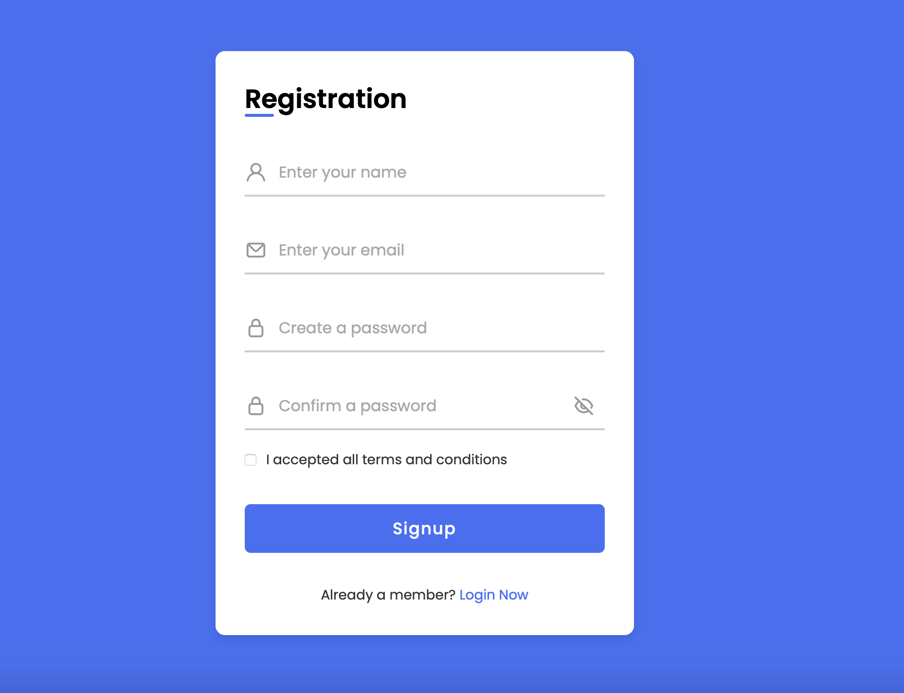

# Login & Registration Form


A responsive and modern **Login & Registration form** built using **HTML, CSS, and JavaScript**.  
The form includes email validation, password show/hide toggle, and basic input checks.

---

## **Features**

- Responsive design for mobile and desktop.
- Toggle password visibility.
- Email validation.
- Password length and confirmation checks.
- Switch between Login and Registration forms.

---

## **Technologies Used**

- HTML5
- CSS3
- JavaScript (Vanilla JS)
- [Unicons](https://iconscout.com/unicons) for icons
- Google Fonts (Poppins)

---

## **Preview**




---

## **Usage / How to Run**

1. Clone the repository:

```bash
git clone https://github.com/YourUsername/login-registration-form.git

Open the project folder.
Open index.html in your browser (Chrome, Firefox, or Edge).
No additional setup required. Fully client-side.

How It Works
Click Signup Now to switch to the registration form.
Click Login Now to switch back to the login form.
Toggle password visibility by clicking the eye icon.
Alerts show if inputs are invalid or passwords do not match.


Author
Sohaila Khalil
GitHub: https://github.com/Sohaila3
LinkedIn: https://www.linkedin.com/in/sohaila-khalil-266391244/
Email: sohylakhalil.31@gmail.com


© 2025 Sohaila Khalil. All rights reserved.